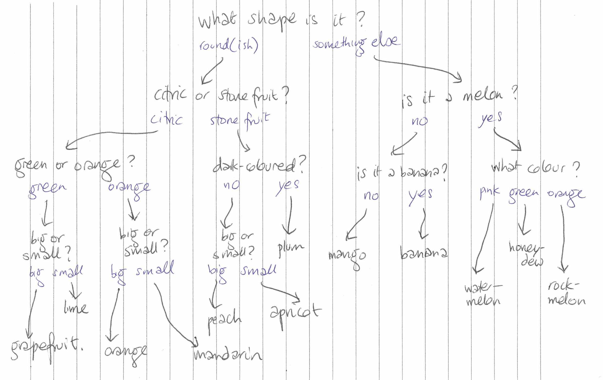

# decision-tree

This is a proof-of-concept for a decision tree that the user can click through, making choices until they reach a final answer.

I made it because I don't have that much experience with tree structures, and wanted to try out working with them. Below, you can find my pen-and-paper representation of the tree I modelled.

See it live [here](https://kfrn.github.io/decision-tree)!

### Local setup

#### Dependencies

* [Elm `0.19`](https://guide.elm-lang.org/install.html)
* [`create-elm-app`](https://github.com/halfzebra/create-elm-app)
* Node.js and `npm`

#### To run locally

```bash
git clone git@github.com:kfrn/decision-tree.git
cd decision-tree/
npm install
npm run build-css
elm-app start
```

### Tests

```bash
elm-app test
```

<!-- To deploy to github pages:
```
elm-app build
gh-pages -d build
```
-->

### The tree



### Credit

Curved arrow by Star and Anchor Design from the Noun Project.
